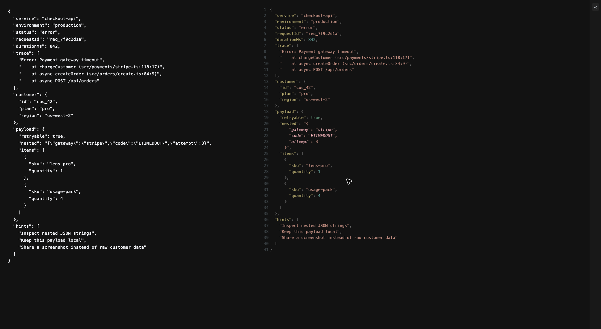
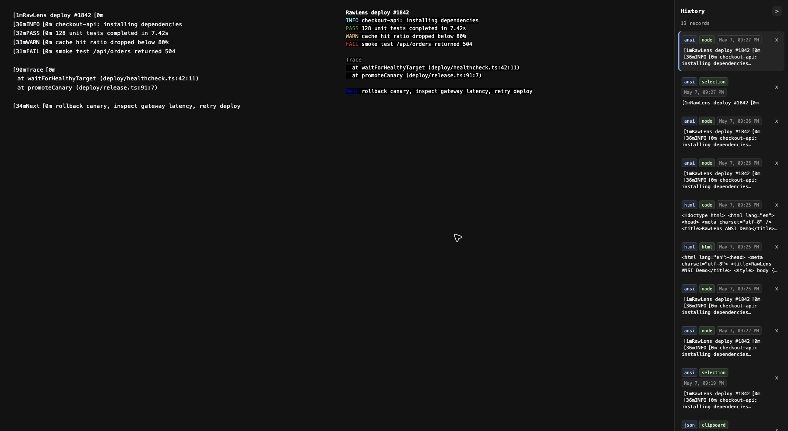
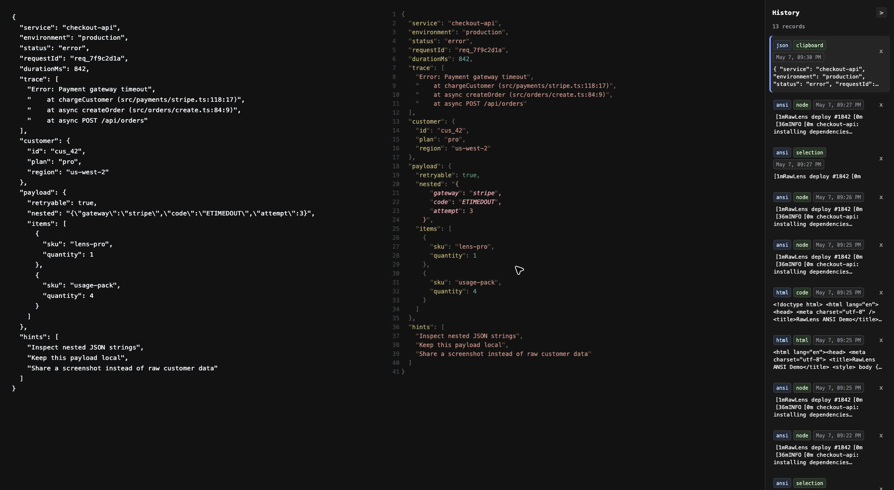

# Log Viewer

Pretty-print raw JSON, ANSI logs, YAML, HTML, JavaScript, CSS, and other source-like text directly in Chrome.

Log Viewer is a privacy-friendly Chrome extension for developers who often open unreadable logs, API responses, CI output,
or config files in the browser. It formats the page in place, supports quick keyboard shortcuts, and keeps a local history
of recently viewed content.

## Why Use It

- Read raw JSON error logs with stack traces, nested JSON strings, and escaped newlines.
- Render ANSI terminal colors from CI logs, build logs, and copied command output.
- Auto-format source-like pages such as YAML, JSON, JavaScript, CSS, Markdown, SQL, diffs, and XML.
- Format selected text, hovered DOM nodes, clipboard content, the current page source, or the current page HTML.
- Reopen recent views from the local History panel without sending content anywhere.
- Use quick shortcuts instead of copying logs into a separate online formatter.

## Install

[](https://chromewebstore.google.com/detail/log-viewer/lbnkfmnolbefifdccejjijdgdipnfaib)

## Showcase

<details open>
<summary>Pretty JSON</summary>



</details>

<details>
<summary>Pretty ANSI</summary>



</details>

<details>
<summary>Pretty YAML</summary>



</details>

## Usage

### Shortcuts

- `vv`: Pretty-print JSON from the current selection or hovered DOM node.
- `pp`: Pretty-print JSON from the clipboard.
- `cc`: Pretty-print the current page source and auto-detect the content type.
- `hh`: Pretty-print the current page HTML.
- `xx`: Pretty-print the current page text content with ANSI colors.
- `ff`: Toggle full-screen mode.
- `Esc`: Close Log Viewer.

### Context Menu

Log Viewer also adds context menu actions for JSON, ANSI, code, and HTML views. Clipboard formatting is only available
through the `pp` shortcut.

### History

Every new view is saved locally in browser-supported IndexedDB storage. History entries include the time, content type,
source type, excerpt, source content, and page URL. Opening an item from History does not create another history record,
and duplicate content is automatically moved to the top with the latest time.

### Automation

Log Viewer automatically opens for source-like pages, such as YAML, JavaScript, CSS, JSON, Markdown, SQL, patch, and diff
resources.

Note: there is no option to disable auto-formatting yet.

## Privacy

Log Viewer runs locally in your browser. It does not collect, sell, transmit, or analyze your logs on a server.

## Dev

1. Clone the repo:

   ```bash
   git clone https://github.com/acrazing/log-viewer.git
   ```

2. Install dependencies:

   ```bash
   yarn i
   ```

3. Start dev server:

   ```bash
   yarn start
   ```

4. Build:

   ```bash
   yarn build
   # or generate a release zip
   ./build.sh
   ```
